# KI Pointcloud Projekt 

## Beschreibung des Datensatzes

Der benutzte Datensatz ist der ModelNet40-Datensatz von folgender Website: https://modelnet.cs.princeton.edu/. Er besteht aus 40 Klassen alltäglicher Objekte, wie beispielsweise eine Tür, ein Auto oder eine Flasche. Für jedes Objekt gibt es einen einzelnen Ordner, dessen Ordner wieder aufgeteilt ist in train und test. Diese enthalten verschiedene Textfiles, die die x, y und z-Koordinaten der Punkte der Pointcloud enthalten. Im folgenden ist ein Beispiel einer Vase bestehend aus 1024 Pointcloud-Punkten zu sehen:

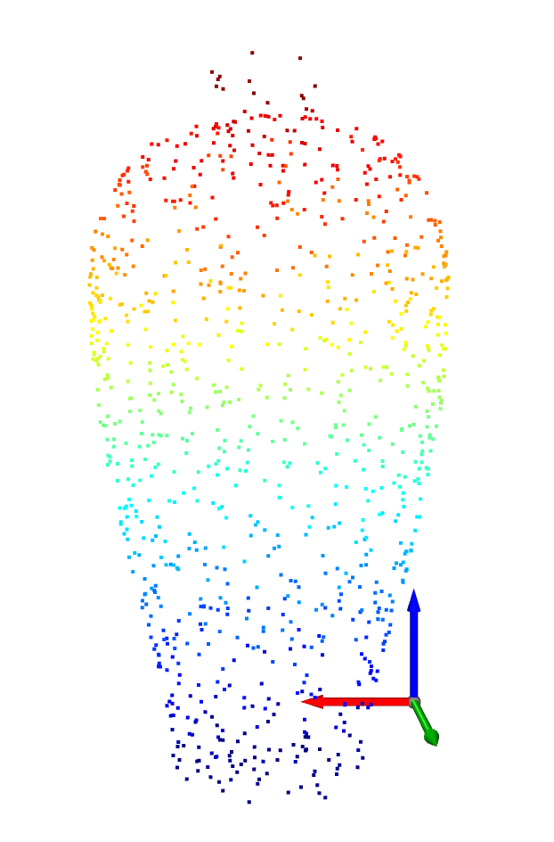

## Beschreibung Transformationen

### Normierung der Pointcloud

Die Normalisierung geschieht dadurch, dass man zuerst von jedem der 1024 Punkte der Pointcloud das arithmetische Mittel der Pointcloud abzieht und sie darauf hin durch das Maximum der euklidischen Norm der y-Werte teilt. 
In folgendem Histogramm erkennt man die x-, y- und z-Koordinatenverteilung vor der Normalisierung ...

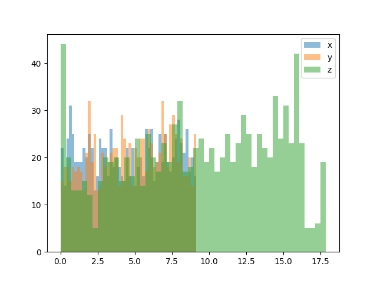 

und danach:

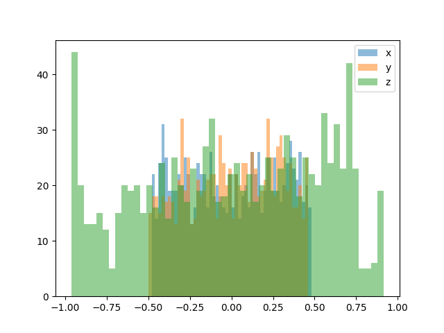

### Cutout

Bei dem Cutout werden mehrmals zufällig ein Punkt und seine nächsten Nachbarn ausgewählt und aus der Pointcloud gelöscht. So schneidet man Teile des von der Pointcloud dargestellten Objekts aus:

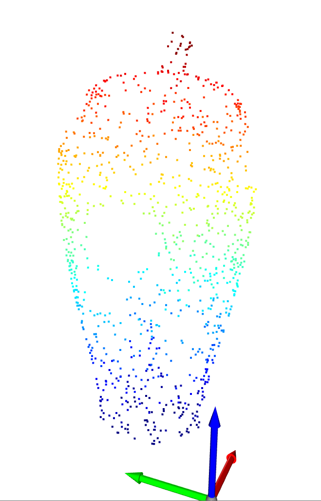

### Gaussian Noise

Hierbei werden aus der Gaußschen Verteilung zufällig Werte ausgewählt und mit einem die Schwere der Transformation beeinflussenden Wert multipliziert (verkleinert). Jeder Wert wird zu genau einem Pointcloud-Koordinatenpunkt addiert. Dadurch ergibt sich die neue Pointcloud, in der jeder Punkt in allen drei Koordinaten etwas verschoben ist. 

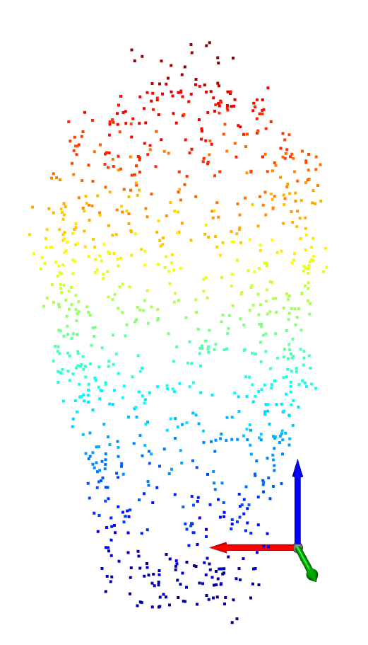

### Background Noise

Bei dem Background-Noise werden zufällig Punkte mit Koordinaten zwischen -1 und 1 zu der Pointcloud hinzugefügt, wie man in folgendem Bild sehen kann:

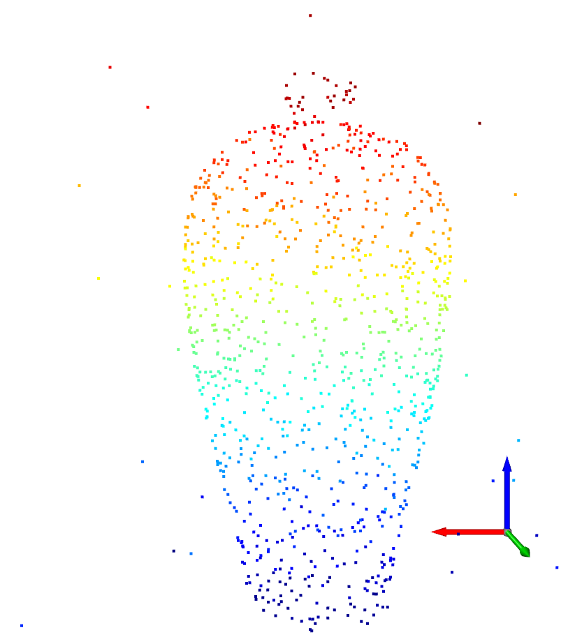

### Impulse Noise

Zu zufällig ausgewählten Punkten der Pointcloud wird je Koordinate ein zufälliger Wert zwischen -0.1 und 0.1 addiert, einige Punkte der Pointcloud werden also geringermaßen verschoben. 

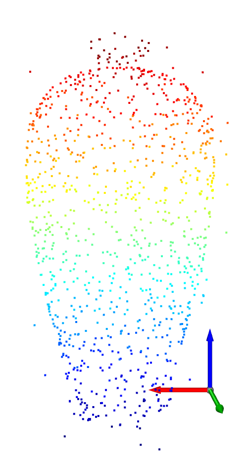

### Shear

Hierbei wird die Pointcloud als Matrix mit folgender Matrix multipliziert: [[1,0,b],[d,1,e],[f,0,1]]. b, d, e und f stellen dabei zufällig negative oder positive Werte dar, die je nach Schweregrad der Transformation kleiner oder größer ausfallen.

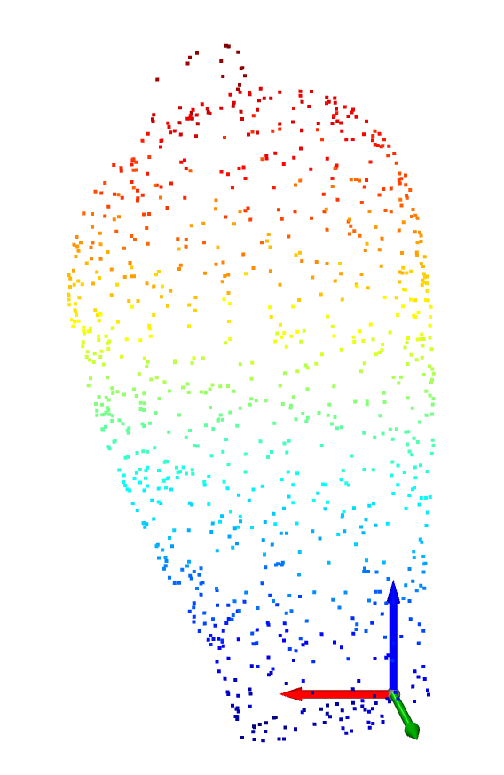

### Rotation

Hierbei wird anhand von Rotationsmatrixen um die x-, y- und z-Achse rotiert, und  zwar um je einen zufälligen, von der Schwere der Rotation abhängigen Grad. 

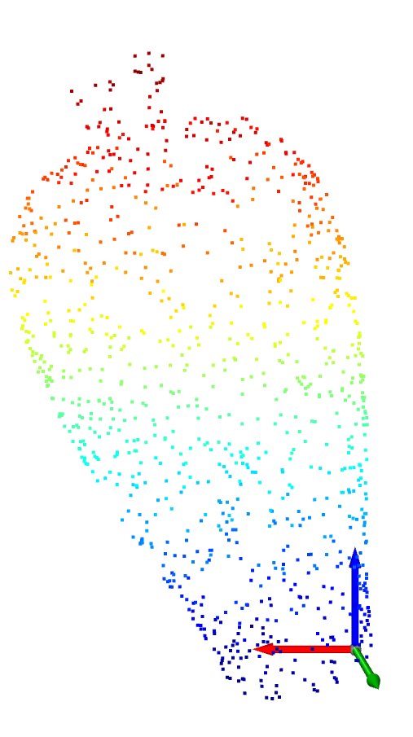

### Upsampling

Bei dem Upsampling werden zusätzlich zu den ursprünglichen Punkten der Pointcloud zufällig Punkte der Pointcloud ausgewählt, zu diesen zufällig Werte zwischen -0.05 und 0.05 addiert und der Pointcloud hinzugefügt.

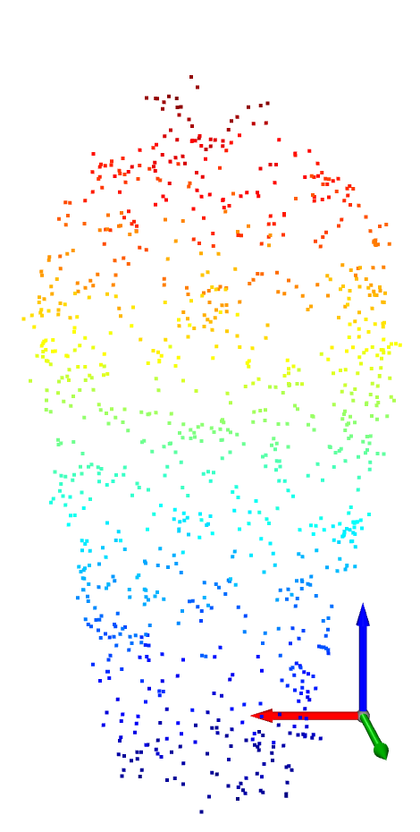

### Density decrease

Aus der Pointcloud werden mehrmals 100 Punkte (ein Punkt und seine nächsten Nachbarn) ausgewählt und davon zufällig 75 aus der Pointcloud gelöscht. Dadurch hat man an einigen Stellen der Pointcloud weniger Punkte, die Dichte wird also heruntergesetzt. Dies ist sehr ähnlich wie Cutout, nur dass bei Cutout eben alle nächsten Nachbarn des Punktes gelöscht werden und nicht nur zufällig einige. 

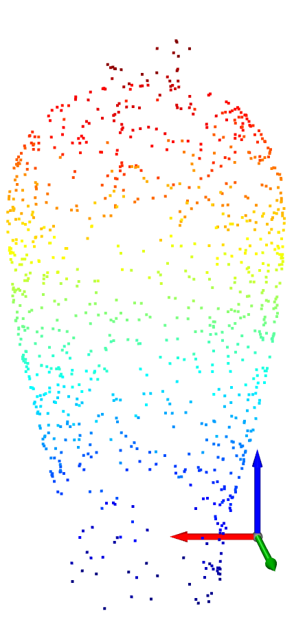

### RBF Distortion und RBF Distortion Invariant

Hierbei werden verschiedene Varianten der radialen Basisfunktion verwendet, um die Form des Objektes zu verändern. In folgenden Bildern sieht man das Ergebnis der RBF Distortion ...

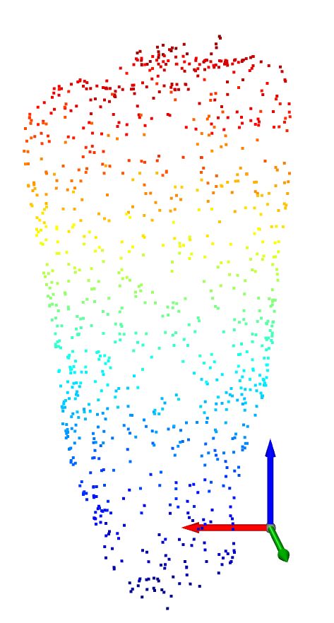

und der RBF Distortion Invariant.

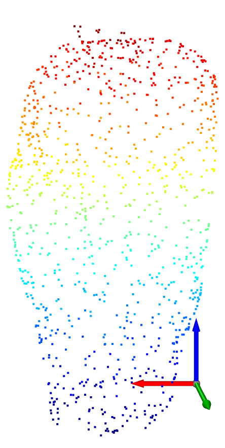

### FFD Distortion

Auch dies wird verwendet um die Form des Objekts zu verändern. Dabei benutzt man allerdings die Freiform-Deformation.

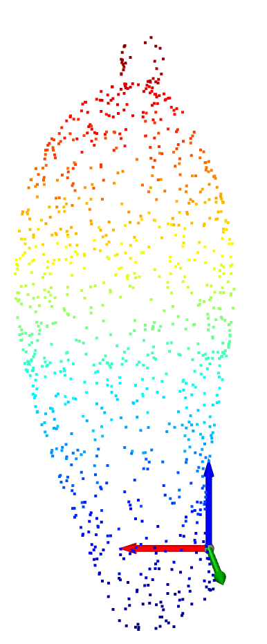

# Beschreibung der Pointcloud-Modelle

## PointNet 

Bei dem PointNet wird für den Umgang mit einem ungeordneten Eingabeset eine einzige symmetrische Funktion, also Maxpooling benutzt. Das Netzwerk lernt eine Gruppe von Optimierungsfunktionen und Kriterien, die die interessanten und informativen Punkte der Pointcloud auswählen und den Grund für deren Auswahl kodieren. Die vollverbundenen Schichten des Netzwerks aggregieren diese gelernten optimalen Werte in eine globale Beschreibung der gesamten Form für die Klassifikation oder sie werden für die Vorhersage der Kennzeichnung der einzelnen Punkte. 
Das Klassifizierungsnetzwerk bekommt n Punkte als Eingabe und wendet darauf Eingabe und Merkmalstransformationen an. Durch Maxpooling werden darauffolgend die Merkmale aggregiert. Als Ausgabe erhält man die Klassifikations-scores für m Klassen. Als Erweiterung davon kann man das Segmentierungsnetzwerk anschließen, um eine Segmentierung durchzuführen. Es konkateniert globale und lokale Eigenschaften und gibt für jeden Punkt den scores aus. 
Bei Pointnet werden für alle Schichten, die ReLU als Aktivierungsfunktion benutzen, auch die Batchnorm angewandt. Mlp steht für Multi-schicht Perceptron, wobei die Zahlen in den Klammern die Schichtgrößen sind. Dropoutschichten werden für das letzte Multischicht-Perceptron in dem Klassifizierungsnetz benuztzt. 

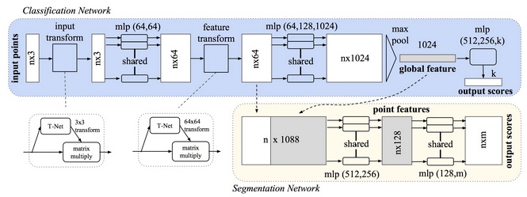

## PointNet++

PointNet++ ist ein hierarchisches Netzwerk, das PointNet rekursiv auf eine verschachtelte Portionierung der Eingabe-Pointcloud anwendet. Neuartige Gruppenlernschichten werden angewandt, um Merkmale verschiedener Skalierungen und Dichten zu kombinieren. Es extrahiert lokale Eigenschaften von kleinen Nachbarschaften,gruppiert diese in größere Einheiten und verarbeitet diese um Merkmale auf höherem Niveau zu produzieren. Dieser Prozess ist rekursiv, bis man die Merkmale der ganzen Punkte erkennt. Für das Lernen der lokalen Eigenschaften wird PoitNet benutzt. 
Die hierarchische Struktur des Netzes besteht aus einer Anzahl von Gruppenabstraktionsschichten. Diese bestehen aus 3 Schichten: Der Auswahlsschicht, der Gruppierungsschicht und der PointNet-Schicht. Für die Klassifizierung werden anschließend daran noch voll verbundene Schichten angeschlossen, um die Klassen-scores zu erhalten. 

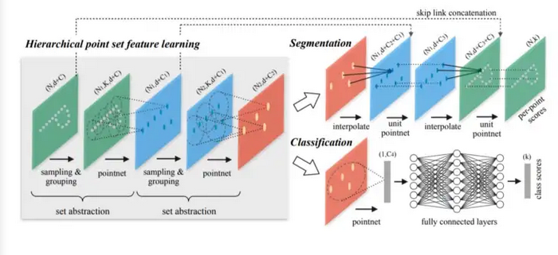

# Vergleich der Ergebnisse
Die Ergebnisse auf dem Validierungsdatensatz mit Pointnet und Pointnet++ lassen sich folgenden Tabellen entnehmen. Die Angaben sind auf zwei Nachkommastellen gerun-det. Vor die Transformationen Cutout, Gaussian_noise, Background_noise und Shear wurde die Rotation geschalten. Die Epochen geben an, wann Early Stopping das Training unterbrochen hat.

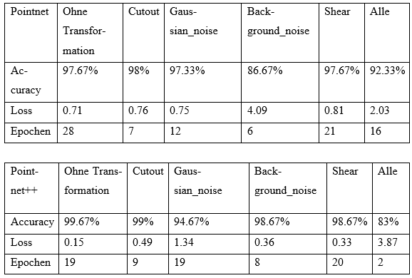

In diesen Tabellen lässt sich erkennen, dass PoinNet++ sich auf dem Validierungsdaten-satz und dem trainierten Modell ohne Transformationen, mit Cutout, mit Back-ground_noise und mit Shear besser geschlagen hat als PointNet. Dabei wurden auf dem Validierungsdatensatz keine Transformationen angewandt, um das Ergebnis auf die Daten des Datensatzes anzupassen.
Folgende Tabellen geben an, was die trainierten Modelle auf dem Testdatensatz voll-bracht haben. Dabei wurde der Testdatensatz einmal normal und je einmal mit jeder Transformation augmentiert an die Modelle übergeben, um deren Ergebnisse vergleichen zu können. Die Angaben in den Tabellen sind in Prozent und auf zwei Nachkommastellen gerundet. 

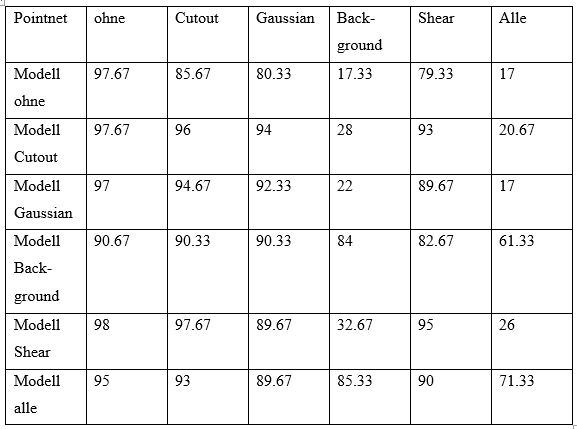

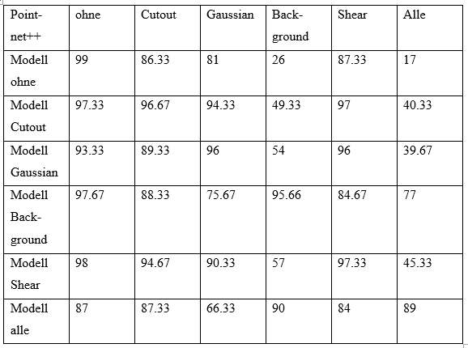

Wie man an der Tabelle sehen kann, scheinen sowohl PointNet als auch PointNet++ Probleme mit der Klassifizierung zu haben, wenn Background_noise oder alle Transfor-mationen zusammen angewandt werden, wobei Pointnet++ besser damit umzugehen scheint. Um gute Ergebnisse bei solchen Eingabedaten zu erzielen, sollte das Modell schon mit solchen Daten trainiert worden sein. Pointnet scheint gegen Transformationen mittels Cutout und Gaussian_noise einigermaßen robust zu sein, und auch bei Shear las-sen sich noch gute Ergebnisse erzielen. Pointnet++ scheint auch gegen Transformationen mittels Cutout und Shear einigermaßen robust, wobei sich mit Gaussian_noise auch noch gute Ergebnisse erzielen lassen. Besonders bei den Eingabedaten, die mit Back-ground_noise und allen Transformationen verändert wurden, erkennt man Unterschiede zwischen Pointnet und Pointnet++. Dabei scheint Pointnet++ besser abzuschneiden als Pointnet. 

